<h2>
EfficientDet-Slightly-Realistic-Japanese-RoadSigns-90classes (Updated: 2022/06/05)
</h2>

This is a slightly realistic project to train and detect RoadSigns in Japan based on 
<a href="https://github.com/google/automl/tree/master/efficientdet">Google Brain AutoML efficientdet</a>.
 
Please also refer to our experimental project <a href="https://github.com/atlan-antillia/EfficientDet-Japanese-RoadSigns">
EfficientDet-Japanese-RoadSigns</a>.
 
Modified to use the TFRecord_Japanese-RoadSigns-90classes_V2.1 in
<a href="https://drive.google.com/drive/folders/1jLK8xfoYydK47q8nomsqCjzDhyg2Npvd?usp=sharing">Japanese_RoadSigns_90classes_V5</a>
 
<h3>
1. Installing tensorflow on Windows10
</h3>
We use Python 3.8.10 to run tensoflow 2.4.2 on Windows10. 
At first, please install <a href="https://visualstudio.microsoft.com/ja/vs/community/">Microsoft Visual Studio Community</a>, which can be used to compile source code of 
<a href="https://github.com/cocodataset/cocoapi">cocoapi</a> for PythonAPI. 
Subsequently, please create a working folder "c:\google" folder for your repository, and install the python packages. 

<pre>
>mkdir c:\google
>cd    c:\google
>pip install -r requirements.txt
>git clone https://github.com/cocodataset/cocoapi
>cd cocoapi/PythonAPI
</pre>
You have to modify extra_compiler_args in setup.py in the following way: 
   extra_compile_args=[],
<pre>
>python setup.py build_ext install
</pre>

 
 
<h3>
2. Installing EfficientDet-Realistic-Japanese-RoadSigns
</h3>
Please clone EfficientDet-Slightly-Realistic-Japanese-RoadSigns.git in the working folder <b>c:\google</b>. 
<pre>
>git clone https://github.com/atlan-antillia/EfficientDet-Slightly-Realistic-Japanese-RoadSigns.git 
</pre>
You can see the following folder <b>projects</b> in  EfficientDet-Japanese-RoadSigns folder of the working folder. 

<pre>
EfficientDet-Slightly-Realistic-Japanese-RoadSigns
└─projects
    └─Japanese_RoadSigns
        ├─eval
        ├─saved_model
        │  └─variables
        ├─realistic_test_dataset
        └─realistic_test_dataset_outputs
</pre>
 
<b>Note:</b> 
You can download TFRecord_Japanese-RoadSigns-90classes_V2.1 from
<a href="https://drive.google.com/drive/folders/1jLK8xfoYydK47q8nomsqCjzDhyg2Npvd?usp=sharing">Japanese_RoadSigns_90classes_V5</a>
 
 

The downloaded train and valid dataset must be placed in ./projects/Japanese_RoadSigns folder.
<pre>
└─projects
    └─Japanese_RoadSigns
        ├─train
        └─valid
</pre>
 

<h3>3. Inspect tfrecord</h3>
 Move to ./projects/Japanese_RoadSigns directory, and run the following bat file: 
<pre>
tfrecord_inspect.bat
</pre>
, which is the following:
<pre>
python ../../TFRecordInspector.py ^
  ./train/*.tfrecord ^
  ./label_map.pbtxt ^
  ./Inspector/train
</pre>
 
This will generate annotated images with bboxes and labels from the tfrecord, and cout the number of annotated objects in it. 
 
<b>TFRecordInspecotr: annotated images in train.tfrecord</b> 
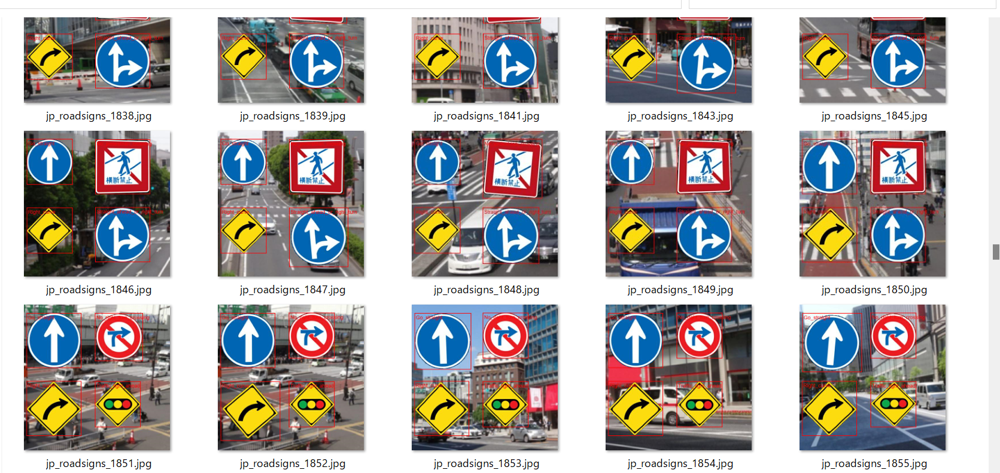
 
 
<b>TFRecordInspecotr: objects_count train.tfrecord</b> 
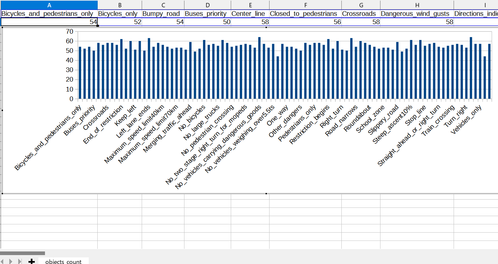
 
This bar graph shows that the number of the objects contained in train.tfrecord.
 
 
 
<h3>4. Downloading the pretrained-model efficientdet-d0</h3>
Please download an EfficientDet model chekcpoint file <b>efficientdet-d0.tar.gz</b>, and expand it in <b>EfficientDet-Japanese-RoadSigns</b> folder. 
 
https://storage.googleapis.com/cloud-tpu-checkpoints/efficientdet/coco2/efficientdet-d0.tar.gz
 
See: https://github.com/google/automl/tree/master/efficientdet 

<h3>5. Training Japanese RoadSigns Model by using pretrained-model</h3>
Please change your current directory to <b>./projects/Japanese_RoadSigns</b>,
and run the following bat file to train Japanese-Roadsigns Efficientdet Model by using the train and valid tfrecords.
<pre>
1_train.bat
</pre>
, which is the following:
<pre>
rem 1_train.bat
python ../../ModelTrainer.py ^
  --mode=train_and_eval ^
  --train_file_pattern=./train/*.tfrecord  ^
  --val_file_pattern=./valid/*.tfrecord ^
  --model_name=efficientdet-d0 ^
  --hparams="input_rand_hflip=False,image_size=512x512,num_classes=90,label_map=./label_map.yaml" ^
  --model_dir=./models ^
  --label_map_pbtxt=./label_map.pbtxt ^
  --eval_dir=./eval ^
  --ckpt=../../efficientdet-d0  ^
  --train_batch_size=4 ^
  --early_stopping=map ^
  --patience=10 ^
  --eval_batch_size=1 ^
  --eval_samples=500  ^
  --num_examples_per_epoch=1000 ^
  --num_epochs=50
</pre>

<table style="border: 1px solid #000;">
<tr>
<td>
--mode</td><td>train_and_eval</td>
</tr>
<tr>
<td>
--train_file_pattern</td><td>./train/*.tfrecord</td>
</tr>
<tr>
<td>
--val_file_pattern</td><td>./valid/*.tfrecord</td>
</tr>
<tr>
<td>
--model_name</td><td>efficientdet-d0</td>
</tr>
<tr><td>
--hparams</td><td>"input_rand_hflip=False,image_size=512x512,num_classes=90,label_map=./label_map.yaml"
</td></tr>
<tr>
<td>
--model_dir</td><td>./models</td>
</tr>
<tr><td>
--label_map_pbtxt</td><td>./label_map.pbtxt
</td></tr>

<tr><td>
--eval_dir</td><td>./eval
</td></tr>

<tr>
<td>
--ckpt</td><td>../../efficientdet-d0</td>
</tr>
<tr>
<td>
--train_batch_size</td><td>4</td>
</tr>
<tr>
<td>
--early_stopping</td><td>map</td>
</tr>
<tr>
<td>
--patience</td><td>10</td>
</tr>

<tr>
<td>
--eval_batch_size</td><td>1</td>
</tr>
<tr>
<td>
--eval_samples</td><td>500</td>
</tr>
<tr>
<td>
--num_examples_per_epoch</td><td>1000</td>
</tr>
<tr>
<td>
--num_epochs</td><td>50</td>
</tr>
</table>
 
 
<b>label_map.yaml:</b>
<pre>
1: 'Bicycles_and_pedestrians_only'
2: 'Bicycles_only'
3: 'Bumpy_road'
4: 'Buses_priority'
5: 'Center_line'
6: 'Closed_to_pedestrians'
7: 'Crossroads'
8: 'Dangerous_wind_gusts'
9: 'Directions_indicator'
10: 'End_of_restriction'
11: 'Falling_rocks'
12: 'Go_straight'
13: 'Keep_left'
14: 'Keep_right'
15: 'Left_curve'
16: 'Left_lane_ends'
17: 'Left_turn'
18: 'Maximum_speed_limit30km'
19: 'Maximum_speed_limit40km'
20: 'Maximum_speed_limit50km'
21: 'Maximum_speed_limit60km'
22: 'Maximum_speed_limit70km'
23: 'Maximum_speed_limit80km'
24: 'Maximum_speed_limit90km'
25: 'Merging_traffic_ahead'
26: 'Minimum_speed_limit30km'
27: 'Minimum_speed_limit50km'
28: 'No_bicycles'
29: 'No_buses'
30: 'No_entry_for_vehicles'
31: 'No_large_trucks'
32: 'No_motorless_vehicle_except_bicycle'
33: 'No_overtaking'
34: 'No_pedestrian_crossing'
35: 'No_right_turn_crossing'
36: 'No_stopping'
37: 'No_twoperson_motorcycles'
38: 'No_two_stage_right_turn_for_mopeds'
39: 'No_u_turns'
40: 'No_vehicles_carrying_dangerous_goods'
41: 'No_vehicles_except_motorcycles'
42: 'No_vehicles_higher_than3.3ms'
43: 'No_vehicles_weighing_over5.5ts'
44: 'No_vehicles_wider_than2.2ms'
45: 'No_waiting'
46: 'One_way'
47: 'One_way_to_the_left'
48: 'One_way_to_the_right'
49: 'Other_dangers'
50: 'Parking_allowed'
51: 'Pedesrtrian_crossing'
52: 'Pedestrians_only'
53: 'Restricted_parking'
54: 'Restricted_zone'
55: 'Restriction_begins'
56: 'Restriction_ends'
57: 'Right_curve'
58: 'Right_turn'
59: 'Roadworks'
60: 'Road_closed_to_all'
61: 'Road_closed_to_vehicles'
62: 'Road_narrows'
63: 'Rotary'
64: 'Roundabout'
65: 'Safety_zone'
66: 'School_crossing'
67: 'School_zone'
68: 'Series_of_curves_to_the_left'
69: 'Series_of_curves_to_the_right'
70: 'Slippery_road'
71: 'Slow_down'
72: 'Sound_horn'
73: 'Steep_ascent10%'
74: 'Steep_descent10%'
75: 'Stop'
76: 'Stopping_allowed'
77: 'Stop_line'
78: 'Straight_ahead_or_left_turn'
79: 'Straight_ahead_or_right_turn'
80: 'Traffic_light_ahead'
81: 'Train_crossing'
82: 'Turn_left'
83: 'Turn_left_or_right'
84: 'Turn_right'
85: 'Two_stage_right_turn_for_mopeds'
86: 'Two_way_traffic_ahead'
87: 'T_junction'
88: 'Vehicles_only'
89: 'Wild_animals_crossing'
90: 'Y_junction'
</pre>
 
 
 
<b><a href="./projects/Japanese_RoadSigns/eval/coco_metrics.csv">COCO meticss f and map</a></b> 
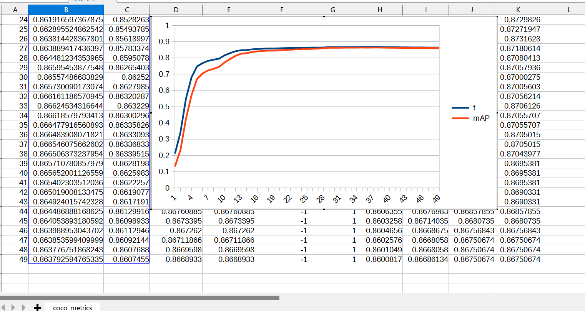
 
 
<b><a href="./projects/Japanese_RoadSigns/eval/train_losses.csv">Train losses</a></b> 
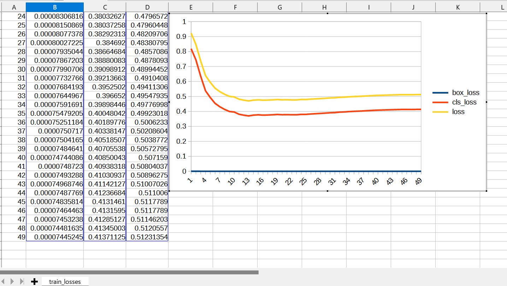
 
 

<b><a href="./projects/Japanese_RoadSigns/eval/coco_ap_per_class.csv">COCO ap per class</a></b> 
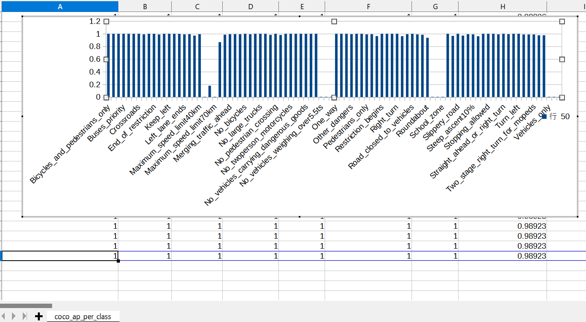
 

<h3>
6. Create a saved_model from the checkpoint
</h3>
 Please run the following bat file to create a saved_model from the checkpoint files in <b>./models</b> folder.  
<pre>
2_create_saved_model.bat
</pre>
, which is the following:
<pre>
rem 2_create_saved_model.bat
python ../../SavedModelCreator.py ^
  --runmode=saved_model ^
  --model_name=efficientdet-d0 ^
  --ckpt_path=./models  ^
  --hparams="image_size=512x512,num_classes=90" ^
  --saved_model_dir=./saved_model
</pre>

<table style="border: 1px solid #000;">
<tr>
<td>--runmode</td><td>saved_model</td>
</tr>

<tr>
<td>--model_name </td><td>efficientdet-d0 </td>
</tr>

<tr>
<td>--ckpt_path</td><td>./models</td>
</tr>

<tr>
<td>--hparams</td><td>"image_size=512x512,num_classes=90"</td>
</tr>

<tr>
<td>--saved_model_dir</td><td>./saved_model</td>
</tr>
</table>

 
 
<h3>
7. Inference RoadSigns by using the saved_model
</h3>
 Please run the following bat file to infer the roadsigns in images of test_dataset:
<pre>
3_inference.bat
</pre>
, which is the folllowing:
<pre>
rem 3_inference.bat
python ../../SavedModelInferencer.py ^
  --runmode=saved_model_infer ^
  --model_name=efficientdet-d0 ^
  --saved_model_dir=./saved_model ^
  --min_score_thresh=0.4 ^
  --hparams="num_classes=90,label_map=./label_map.yaml" ^
  --input_image=./realistic_test_dataset/*.jpg ^
  --classes_file=./classes.txt ^
  --ground_truth_json=./realistic_test_dataset/annotation.json ^
  --output_image_dir=./realistic_test_dataset_outputs
</pre>

<table style="border: 1px solid #000;">
<tr>
<td>--runmode</td><td>saved_model_infer </td>
</tr>
<tr>
<td>--model_name</td><td>efficientdet-d0 </td>
</tr>

<tr>
<td>--saved_model_dir</td><td>./saved_model </td>
</tr>

<tr>
<td>--min_score_thresh</td><td>0.4 </td>
</tr>

<tr>
<td>--hparams</td><td>"num_classes=90,label_map=./label_map.yaml"</td>
</tr>

<tr>
<td>--input_image</td><td>./realistic_test_dataset/*.jpg</td>
</tr>

<tr>
<td>--classes_file</td><td>./classes.txt</td>
</tr>

<tr>
<td>--ground_truth_json</td><td>./realistic_test_dataset/annotation.json</td>
</tr>

<tr>
<td>--output_image_dir</td><td>./realistic_test_dataset_outputs</td>
</tr>
</table>
 
<h3>
8. Some Inference results of Japanese RoadSigns
</h3>

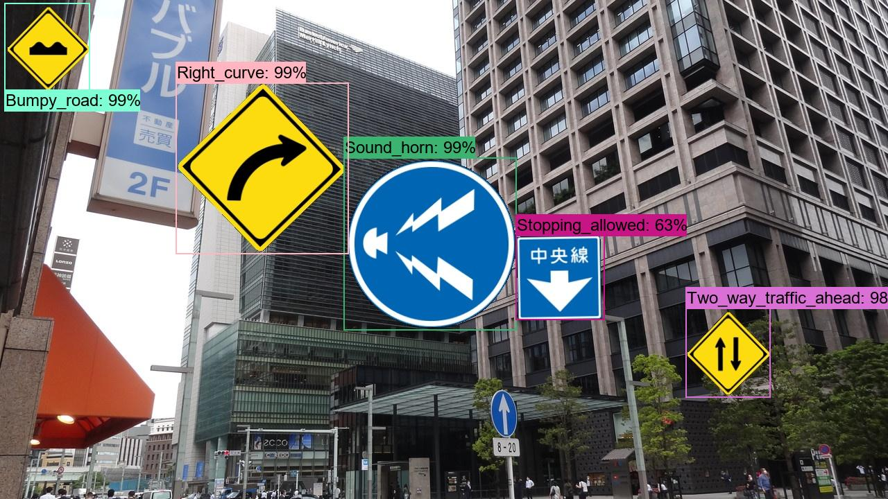 
<a href="./projects/Japanese_RoadSigns/realistic_test_dataset_outputs/jp_roadsigns_1001.jpg_objects.csv">roadsigns1001.jpg_objects.csv</a> 
 
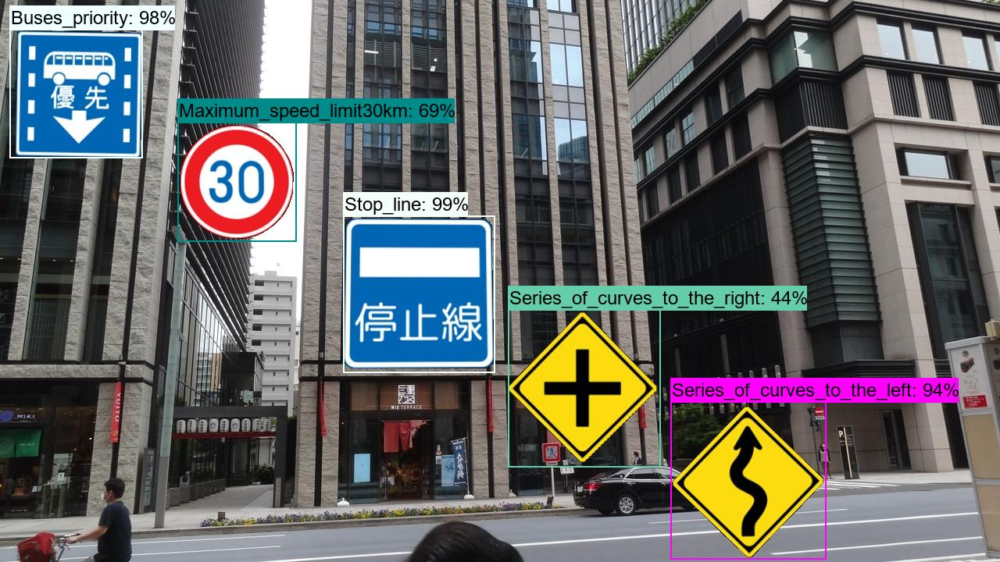 
<a  href="./projects/Japanese_RoadSigns/realistic_test_dataset_outputs/jp_roadsigns_1012.jpg_objects.csv">roadsigns1002.jpg_objects.csv</a> 
 
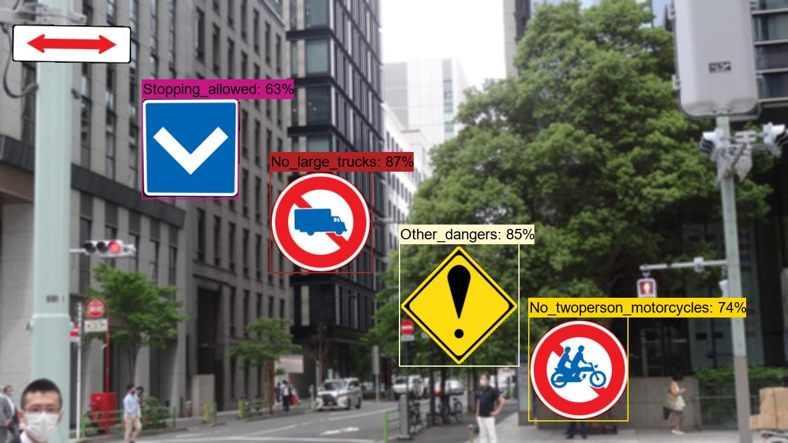 
<a  href="./projects/Japanese_RoadSigns/realistic_test_dataset_outputs/jp_roadsigns_1023.jpg_objects.csv">roadsigns1003.jpg_objects.csv</a> 
 
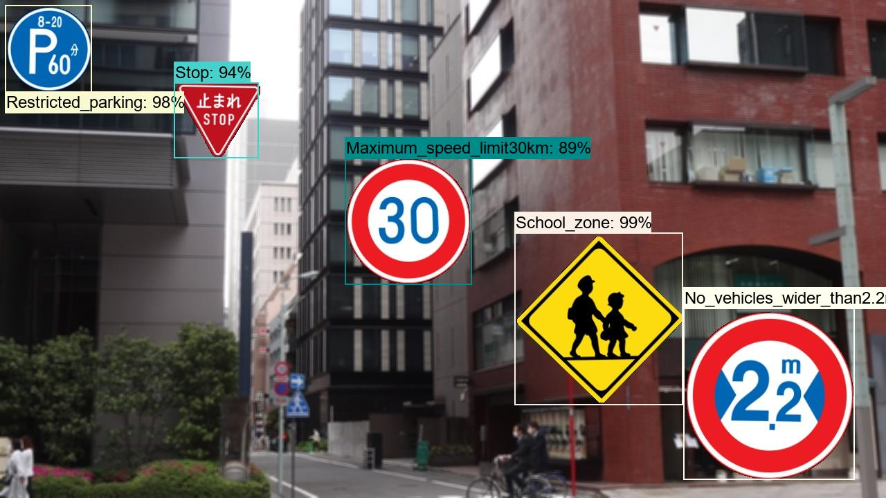 
<a  href="./projects/Japanese_RoadSigns/realistic_test_dataset_outputs/jp_roadsigns_1034.jpg_objects.csv">roadsigns1004.jpg_objects.csv</a> 
 
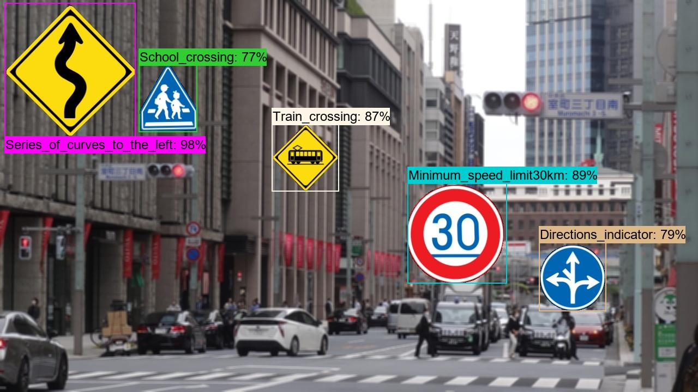 
<a  href="./projects/Japanese_RoadSigns/realistic_test_dataset_outputs/jp_roadsigns_1045.jpg_objects.csv">roadsigns1005.jpg_objects.csv</a> 
 
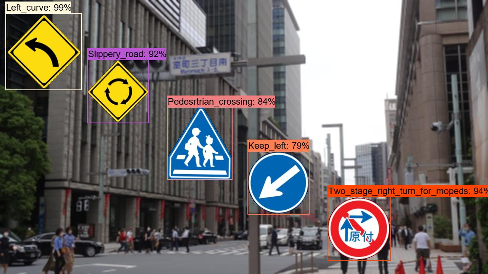 
<a  href="./projects/Japanese_RoadSigns/realistic_test_dataset_outputs/jp_roadsigns_1056.jpg_objects.csv">roadsigns1006.jpg_objects.csv</a> 
 
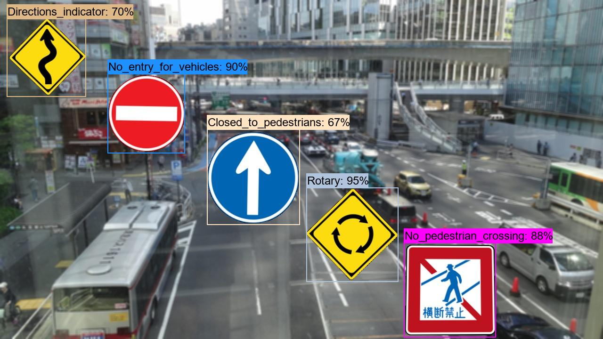 
<a  href="./projects/Japanese_RoadSigns/realistic_test_dataset_outputs/jp_roadsigns_1067.jpg_objects.csv">roadsigns1007.jpg_objects.csv</a> 
 
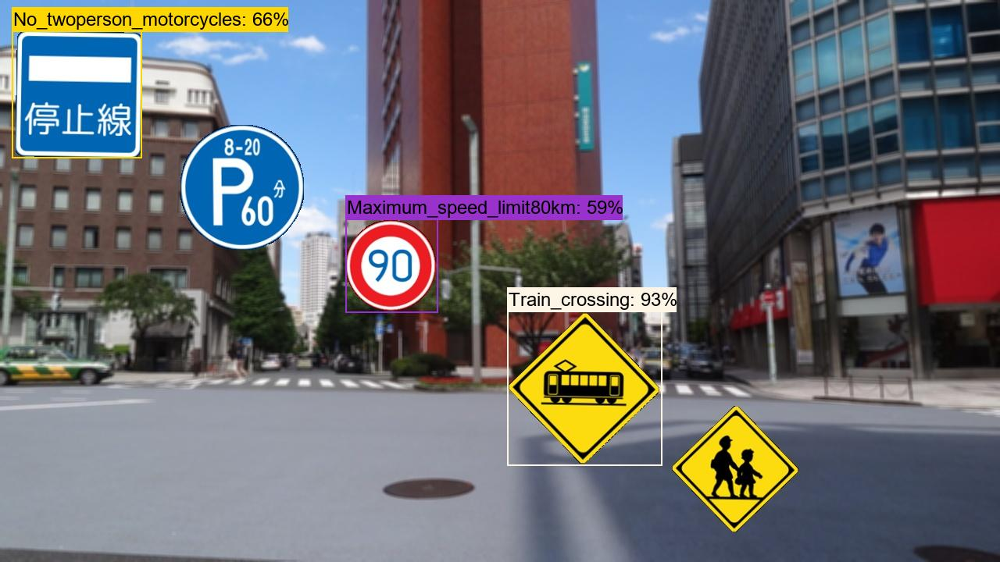 
<a  href="./projects/Japanese_RoadSigns/realistic_test_dataset_outputs/jp_roadsigns_1078.jpg_objects.csv">roadsigns1008.jpg_objects.csv</a> 
 
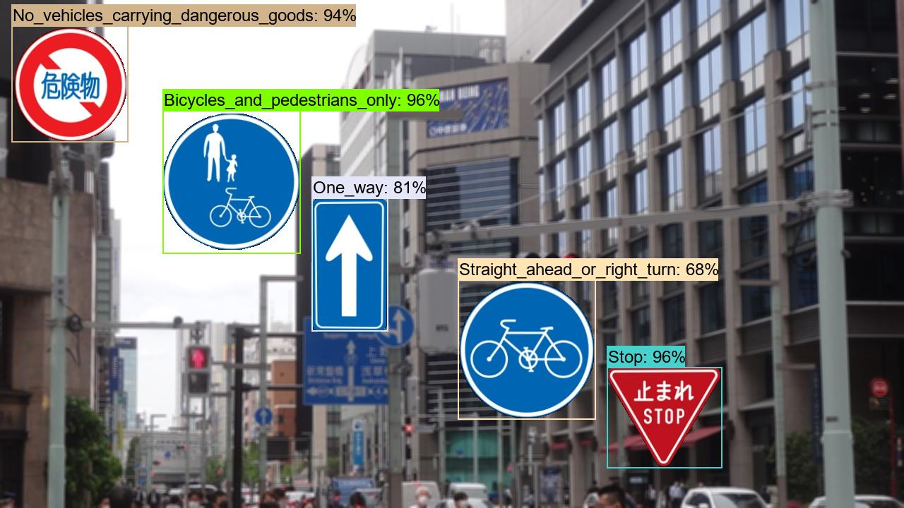 
<a  href="./projects/Japanese_RoadSigns/realistic_test_dataset_outputs/jp_roadsigns_1089.jpg_objects.csv">roadsigns1009.jpg_objects.csv</a> 
 
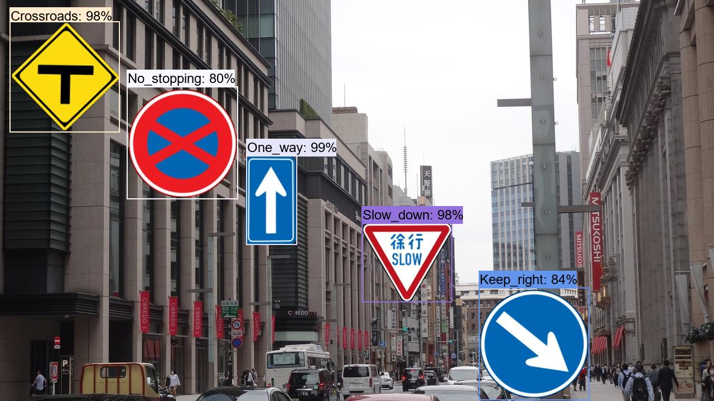 
<a  href="./projects/Japanese_RoadSigns/realistic_test_dataset_outputs/jp_roadsigns_1099.jpg_objects.csv">roadsigns1010.jpg_objects.csv</a> 
 

<h3>9. COCO metrics of inference result</h3>
By running 3_inference bat file, a COCO map to the realistic_test_dataset is also computed as shown below: 

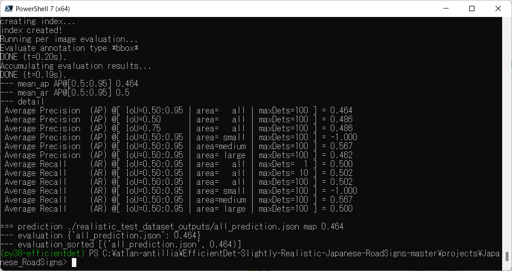 

 
